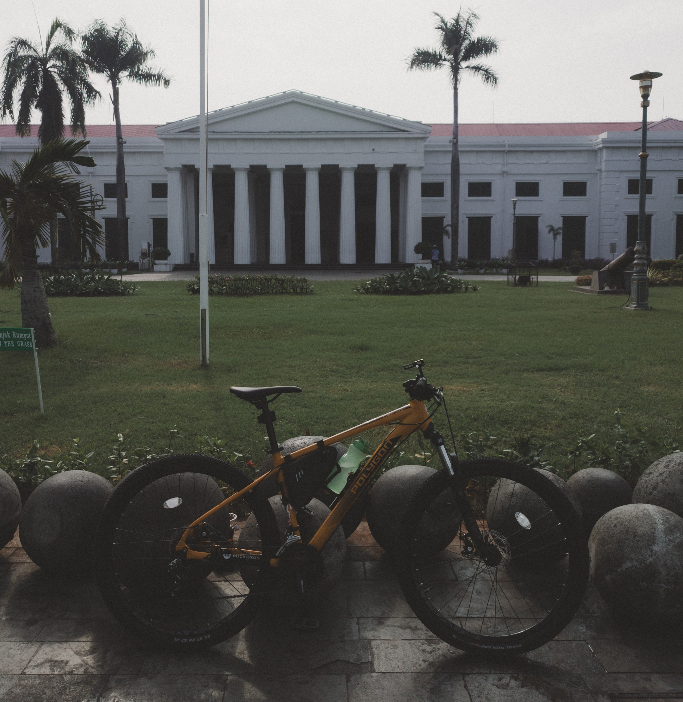
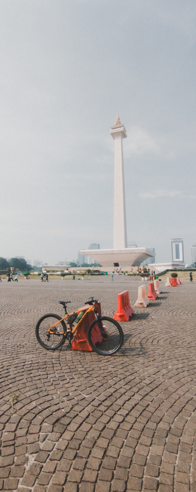
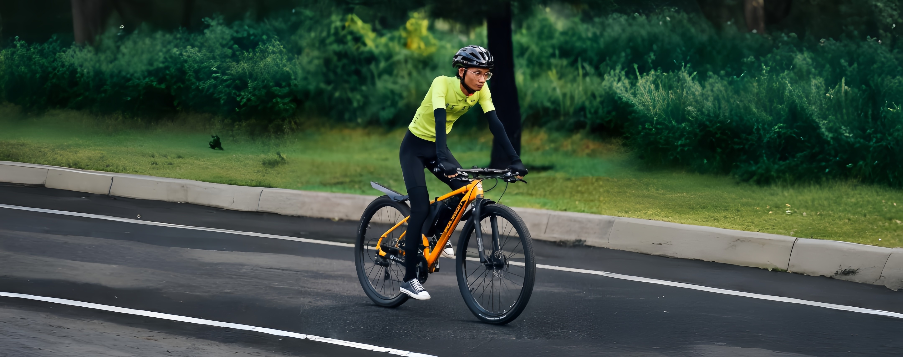
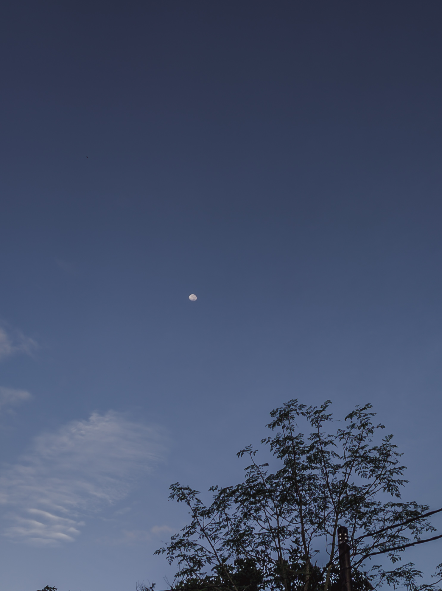
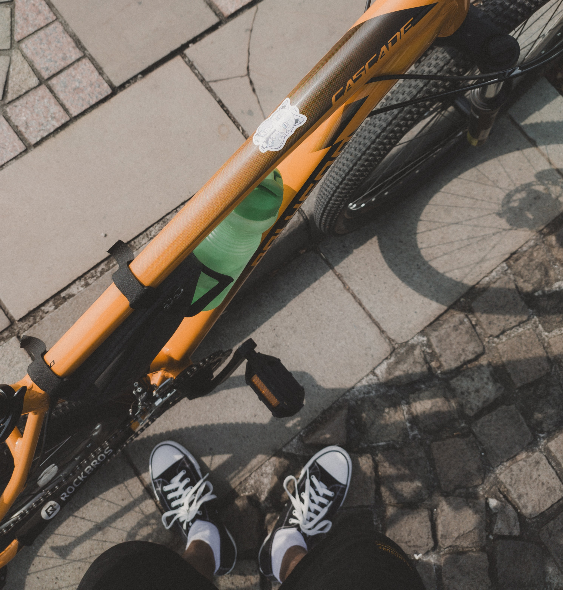
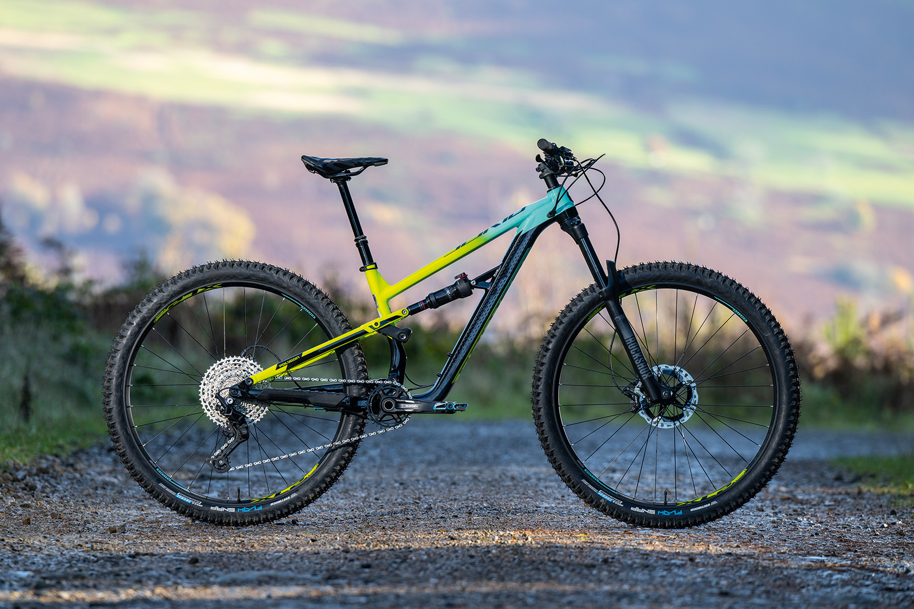

# PerancanganWeb-DesainGrafis-BisDig

## 1. TombolKomentar

**Deskripsi**  
Pada awalnya, komentar tidak akan terlihat saat halaman pertama kali dimuat. Komentar hanya akan muncul setelah tombol "Tampilkan Komentar" diklik. Setelah komentar muncul, tombol akan berubah teks menjadi "Sembunyikan Semua Komentar", dan jika diklik lagi, komentar akan disembunyikan kembali dengan mengubah teks tombol menjadi "Tampilkan Semua Komentar".

**Cara Kerja**
1. Saat halaman dimuat:
   - Komentar akan disembunyikan dengan atribut `style="display: none;"` pada elemen `div.commentsSection`.
2. Ketika tombol "Tampilkan Komentar" diklik:
   - Fungsi `JavaScript toggleComments()` dijalankan.
   - Fungsi ini memeriksa apakah komentar sedang disembunyikan.
   - Jika disembunyikan, komentar akan ditampilkan dengan mengubah gaya display menjadi `block`, dan teks tombol menjadi "Sembunyikan Semua Komentar".
   - Jika komentar sudah ditampilkan, maka komentar akan disembunyikan kembali dan teks tombol akan berubah menjadi "Tampilkan Semua Komentar".

[TombolKomentar](https://gist.github.com/JAJI123/54717130a4eca9cc86d55b2209ccb2ab)

---

## 2. Struktur Dasar HTML5

Untuk membuat halaman profil fotografer profesional, struktur HTML5 yang baik biasanya terdiri dari bagian-bagian berikut:

1. `<!DOCTYPE html>`  
   • Deklarasi DOCTYPE di awal memberi tahu browser bahwa dokumen menggunakan standar HTML5.

2. `<html lang="id">`  
   • Tag pembungkus utama untuk seluruh dokumen HTML. Atribut `lang="id"` menunjukkan bahwa bahasa utama halaman adalah Bahasa Indonesia.

3. `<head>`  
   • Berisi metadata tentang halaman seperti judul dan informasi tambahan.

4. `<body>`  
   • Bagian utama dari halaman yang menampilkan konten kepada pengguna.

### Halaman ini dibuat menggunakan struktur HTML5:

• `<header>`: Menampilkan nama fotografer  
• `<main>`: Konten utama halaman  
 ◦ `<section>` Tentang Saya: Menjelaskan siapa fotografer  
 ◦ `<section>` Galeri: Menampilkan beberapa hasil karya fotografi  
• `<footer>`: Menampilkan tautan ke Instagram dan Strava serta copyright 

<table>
  <tr>
    <td></td>
    <td></td>
  </tr>
  <tr>
    <td></td>
    <td></td>
  </tr>
  <tr>
    <td></td>
    <td></td>
  </tr>
</table>

[Halaman profil seorang fotografer](https://gist.github.com/JAJI123/ce83e6465674b39cc346f82d5ecb6e59)

---

## Jawaban No3 ada di E-campus

---

## 4. Portofolio

**Responsive design** adalah cara membuat tampilan website supaya bisa menyesuaikan secara otomatis dengan ukuran layar perangkat yang digunakan, seperti komputer atau ponsel. Hal ini membuat website terlihat rapi dan tidak berantakan.

**Media Queries**  
Media queries adalah fitur CSS yang memungkinkan kita menulis aturan gaya berbeda berdasarkan kondisi perangkat, seperti lebar layar atau resolusi.  
Dengan media queries, kita bisa mengubah tampilan website agar sesuai dengan ukuran layar pengguna.

[Portofolio](https://gist.github.com/JAJI123/8f27ee716390e538e3d576795311fb05)

---

## 5. PromoCard

**Manfaat**  
Visualisasi awal membantu memberikan gambaran tentang tampilan website, memudahkan untuk memahami produk sebelum implementasi, serta mengidentifikasi masalah sejak awal (seperti layout, navigasi, atau visual).

**PromoCard - Landing Page Promosi**  
Proyek ini adalah contoh implementasi PromoCard untuk landing page promosi. PromoCard ini dibuat menggunakan HTML dasar, dan berisi:
- Elemen gambar
- Judul
- Deskripsi promosi
- Tombol ajakan (Call to Action)

[PromoCard](https://gist.github.com/JAJI123/fd710c8945e286c3672eacb78baff8ab)
